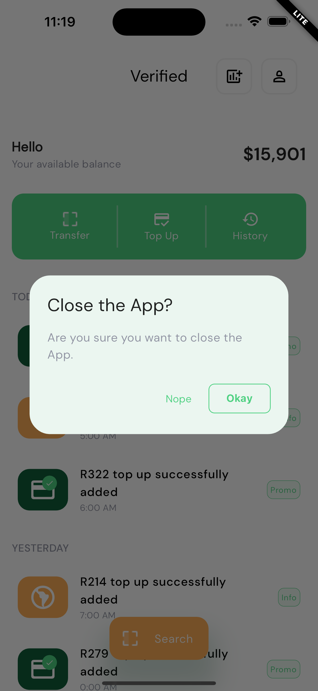

**App Name:** Verified+

**Description:**

Unlock a world of secure and convenient verification with Verified Plus, your trusted partner in identity authentication. Leveraging the power of government data, we bring you a cutting-edge solution to ensure the utmost security and reliability in identity verification.

**Why us?**

🔒 **Government-Backed Verification:** We access official government databases to verify and authenticate user identities. This includes driver's licenses, passports, Social Security records, and more. Rest assured, your identity is verified with the highest level of authority.

📱 **User-Friendly Interface:** Our intuitive app is designed for ease of use. Simply follow the on-screen instructions to complete the verification process quickly and effortlessly.

🕒 **Swift Verification:** Say goodbye to time-consuming manual verification processes. With Verified Plus, you can verify your identity within minutes, enabling you to access services faster.

🌟 **Trustworthy Partner:** We collaborate with government agencies to ensure the most up-to-date and accurate data for verification. Our commitment to trust and transparency is unwavering.

👤 **Business Solutions:** For enterprises and institutions, Verified Plus offers a comprehensive identity verification API, allowing seamless integration into your existing systems for enhanced customer onboarding and fraud prevention.

📜 **Compliance-Ready:** Stay compliant with local and international regulations effortlessly. Verified Plus helps businesses meet KYC (Know Your Customer) and AML (Anti-Money Laundering) requirements.

📈 **Transparent Pricing:** No hidden fees or surprises. Our pricing is clear, affordable, and scales to fit your needs, whether you're an individual or a business.

Experience the future of identity verification with Verified Plus. Download now and take control of your online identity with confidence.

---

    
    
    

      
      
      

---